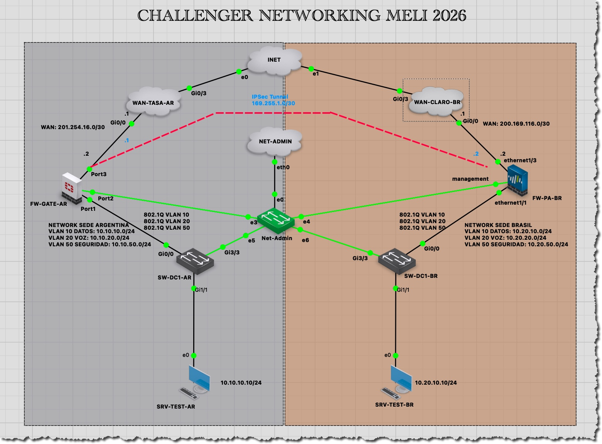
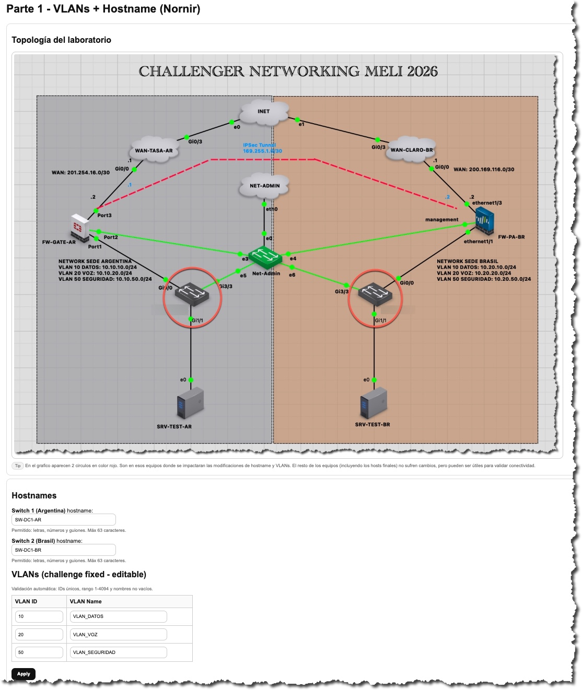
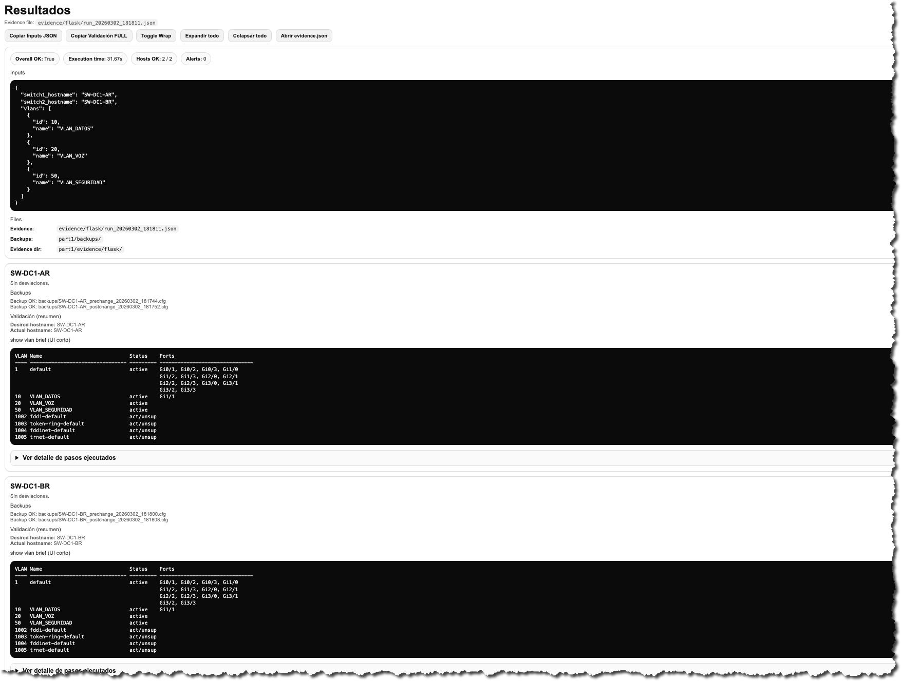

# MELI Technical Challenge — Parte 1 y Parte 2 (Automatización de Redes)

Este repositorio contiene mi solución al **Laboratorio de Candidatos – Networking Mercado Libre 2026**.

El objetivo general del challenge es:

> Evaluar la capacidad del candidato para desarrollar automatización de red, validaciones de configuración, planificación de VPN IPSec entre dispositivos heterogéneos y uso adecuado de control de versiones con Git.

---

## 📌 Descripción del Challenge

El challenge está dividido en dos partes:

### 🔹 Parte 1 – Automatización de Switch Cisco (L2)

- Desarrollo de automatización en **Python**
- Interfaz frontend para configuración de **VLANs** y **hostnames**
- Configuración automática de:
  - VLAN 10 – VLAN_DATOS
  - VLAN 20 – VLAN_VOZ
  - VLAN 50 – VLAN_SEGURIDAD
- Cambio de hostname
- Guardado en NVRAM
- Backups automáticos (pre/post)
- Validación post-configuración
- Evidencia generada por corrida (timestamp)

### 🔹 Parte 2 – Automatización VPN IPSec (FortiGate ↔ Palo Alto)

- Configuración de túnel IPSec entre:
  - FortiGate (Argentina)
  - Palo Alto (Brasil)
- Red de túnel: `169.255.1.0/30`
- Automatización mediante APIs / módulos Ansible
- Validaciones + evidencia
- Backups pre y post cambio

El enunciado completo se encuentra incluido en el repositorio.

---

## 🏗️ Arquitectura del Laboratorio (GNS3 + Docker)

El laboratorio fue desarrollado utilizando:

- 🖥️ **GNS3-Server** para simulación realista de dispositivos
- 🐳 **Docker** para encapsular el entorno de automatización
- 🧠 Automatización ejecutándose dentro de un contenedor reproducible
- 🔌 GNS3 ejecutándose en un servidor externo con soporte KVM

### 🗺️ Topología del Laboratorio



---

## ⚠️ Consideración Técnica (GNS3 y macOS)

No fue posible virtualizar GNS3 dentro de Docker en macOS debido a:

- Requerimiento de virtualización basada en **KVM**
- macOS no soporta KVM de forma nativa
- Docker Desktop no expone virtualización anidada compatible

Por este motivo:

- **GNS3-Server fue desplegado en un servidor externo con soporte KVM**
- El contenedor Docker se conecta a los dispositivos del laboratorio vía red (escenario realista de automatización distribuida)

---

## 🌎 Diseño del Laboratorio — Modelo Multisede

El laboratorio fue diseñado simulando un escenario real de empresa multinacional, con dos sucursales interconectadas mediante VPN IPSec:

- 🇦🇷 Argentina
- 🇧🇷 Brasil

Esta decisión fue intencional para representar un entorno acorde a una empresa global como Mercado Libre.

### 🇦🇷 Sede Argentina

**WAN**
- `201.254.16.0/30` (Proveedor: TASA)

**Redes internas**
- VLAN 10 – DATOS: `10.10.10.0/24`
- VLAN 20 – VOZ: `10.10.20.0/24`
- VLAN 50 – SEGURIDAD: `10.10.50.0/24`

**Host de prueba**
- SRV-TEST-AR → `10.10.10.10/24`

### 🇧🇷 Sede Brasil

**WAN**
- `200.169.116.0/30` (Proveedor: CLARO)

**Redes internas**
- VLAN 10 – DATOS: `10.20.10.0/24`
- VLAN 20 – VOZ: `10.20.20.0/24`
- VLAN 50 – SEGURIDAD: `10.20.50.0/24`

**Host de prueba**
- SRV-TEST-BR → `10.20.10.10/24`

### 🔐 Túnel IPSec

- Red de túnel: `169.255.1.0/30`
- `.1` → FortiGate (Argentina)
- `.2` → Palo Alto (Brasil)

El túnel permite comunicación segura entre ambas sedes para validaciones de conectividad y automatización.

---

## 🧠 Decisiones Técnicas

### 🔵 Parte 1 — Nornir + Flask

Framework / stack utilizado:

- **Nornir**
- **Netmiko**
- nornir_netmiko
- Flask
- Jinja2

Motivos principales:

- Modelo concurrente (ejecución eficiente sobre múltiples equipos)
- Inventario estructurado y reutilizable
- Integración directa con Netmiko
- Ideal para automatización L2/L3

Frontend desarrollado con Flask (UI simple, funcional y reproducible).

### 🟢 Parte 2 — Ansible Multi-Vendor

Framework / stack utilizado:

- **Ansible**
- colecciones:
  - fortinet.fortios
  - paloaltonetworks.panos
  - ansible.netcommon

Interacción:

- API REST Palo Alto
- API FortiGate

Motivos principales:

- Idempotencia
- Separación clara de playbooks
- Integración nativa con APIs de seguridad
- Excelente para automatización multi-vendor

---

## 🔐 Consideración de Seguridad — Propuestas IPSec

Durante la implementación del laboratorio se utilizaron propuestas de cifrado compatibles con ambos dispositivos dentro de sus limitaciones de licencia.

En el entorno GNS3 utilizado:

- El FortiGate disponible presenta restricciones en propuestas avanzadas (según licencia del appliance virtual).
- El Palo Alto VM en modo laboratorio también posee limitaciones en ciertos algoritmos.

Por este motivo, se seleccionó una propuesta compatible entre ambos equipos para garantizar interoperabilidad del laboratorio.

⚠️ Importante: en un entorno productivo real se recomienda:

- AES-256
- SHA-256 o superior
- DH Group 14 o superior
- IKEv2

El uso de algoritmos más débiles en este laboratorio responde exclusivamente a restricciones del entorno de prueba.

---

## 🏢 Consideraciones de Escalabilidad y Gestión Centralizada

Si este entorno creciera a múltiples dispositivos por sede, se recomienda:

### Palo Alto — Panorama

Para más de 5 dispositivos, se recomienda implementar **Panorama** como plataforma centralizada de gestión.

Beneficios:

- Administración unificada
- Control de versiones de políticas
- Gestión centralizada de templates
- Rollback seguro
- Visibilidad global

### Fortinet — FortiManager

Para múltiples FortiGate, se recomienda utilizar **FortiManager**.

Beneficios:

- ADOMs para segmentación por región
- Control centralizado de políticas
- Gestión de cambios
- Automatización masiva
- Control de versiones

Estas plataformas permiten escalar la solución manteniendo gobernanza y control operativo.

---

## 🐳 Docker Compose

Se utilizó un único contenedor que incluye:

- Python 3.10
- Nornir
- Ansible
- Dependencias necesarias
- Separación lógica:
  - `/part1`
  - `/part2`

Esto garantiza reproducibilidad del entorno.

---

## 📂 Estructura del Repositorio

```text
.
├── docker-compose.yml
├── Makefile
├── .env
├── .env.example
├── part1/
├── part2/
├── docs/
└── scripts/


⸻

🚀 Inicio Rápido (Modo Evaluador)

1️⃣ Clonar el repositorio

git clone https://github.com/kurt00ar/challenge-networking-meli-2026.git
cd challenge-networking-meli-2026

2️⃣ Configurar variables de entorno

cp .env.example .env

Completar en .env:
	•	PAN_HOST
	•	PAN_API_KEY
	•	PAN_WAN_IF
	•	PAN_VSYS
	•	PAN_VR
	•	FGT_HOST
	•	FGT_USER
	•	FGT_PASS
	•	VPN_PSK

3️⃣ Construir y levantar el entorno

docker compose up -d --build
docker compose ps

4️⃣ Ejecutar automatización completa

make part2-run-all


⸻

🔵 Parte 1 — Automatización L2 (VLANs + Hostname)

La Parte 1 implementa automatización sobre switches Cisco utilizando Nornir + Netmiko, con una interfaz web desarrollada en Flask.

El objetivo fue simular un escenario real de provisión inicial de switches en sedes remotas, incluyendo configuración, validación y generación de evidencia automática.

Funcionalidades implementadas
	•	Creación automática de VLANs
	•	Cambio de hostname
	•	Guardado en NVRAM
	•	Backup pre y post cambio
	•	Validación automática de configuración
	•	Generación de evidencia JSON por ejecución (timestamp)

📸 Interfaz Web (Configuración VLANs y Hostnames)


📸 Resultados y Evidencia Generada


Evidencia y backups generados:
	•	UI evidence: part1/evidence/flask/
	•	Backups: part1/backups/

⸻

🟢 Parte 2 — VPN IPsec (FortiGate ↔ Palo Alto)

Flujo de ejecución:
	1.	00_pre_backup.yml
	2.	01_fortigate_ipsec.yml
	3.	02_paloalto_ipsec.yml
	4.	03_paloalto_network.yml
	5.	04_validate.yml
	6.	06_post_backup.yml

Evidencia y backups generados:
	•	Evidencia: part2/evidence/<timestamp>/
	•	Backups FortiGate: part2/backups/fortigate/<timestamp>/
	•	Backups Palo Alto: part2/backups/paloalto/<timestamp>/

🔎 Validaciones implementadas
	•	Asociación del túnel al Virtual Router
	•	Membresía en zona VPN
	•	Políticas de firewall
	•	Rutas estáticas
	•	Conectividad validada vía playbooks

⸻

♻️ Reset completo del entorno

docker compose down -v --remove-orphans
docker image rm challenge-networking-meli-2026:1.0.0 2>/dev/null || true
docker builder prune -f
docker compose up -d --build


⸻

🎥 Evidencia adicional (video)

Se recomienda acompañar este repositorio con un video corto (7–10 minutos) mostrando:
	1.	Arquitectura (GNS3 + Docker)
	2.	Ejecución Parte 1 (UI + evidencia)
	3.	Ejecución Parte 2 (Ansible + backups + validaciones)
	4.	Estructura de evidencia por timestamp y commits en Git

Si se requiere acceso al laboratorio para validación técnica, puedo generar accesos VPN temporales bajo solicitud.

⸻

🧩 Consideraciones Finales
	•	Proyecto orientado a laboratorio
	•	Arquitectura reproducible
	•	Evidencia organizada
	•	Automatización multi-vendor
	•	Control de versiones aplicado

---